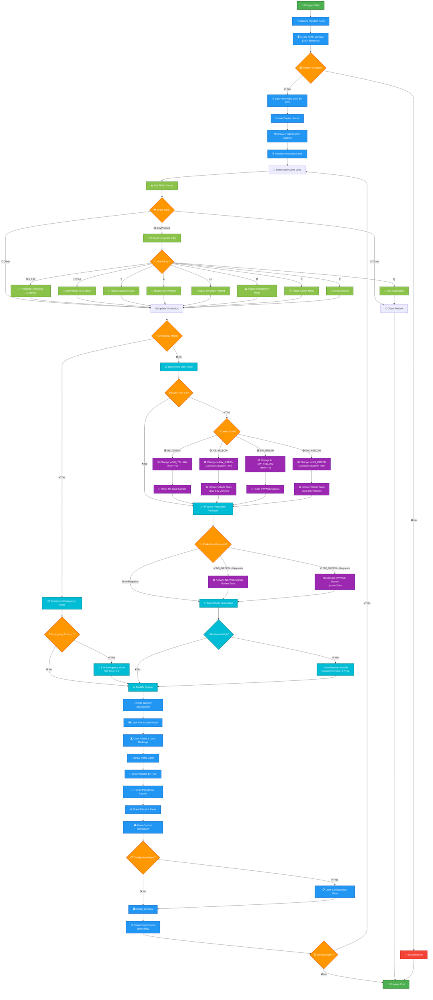
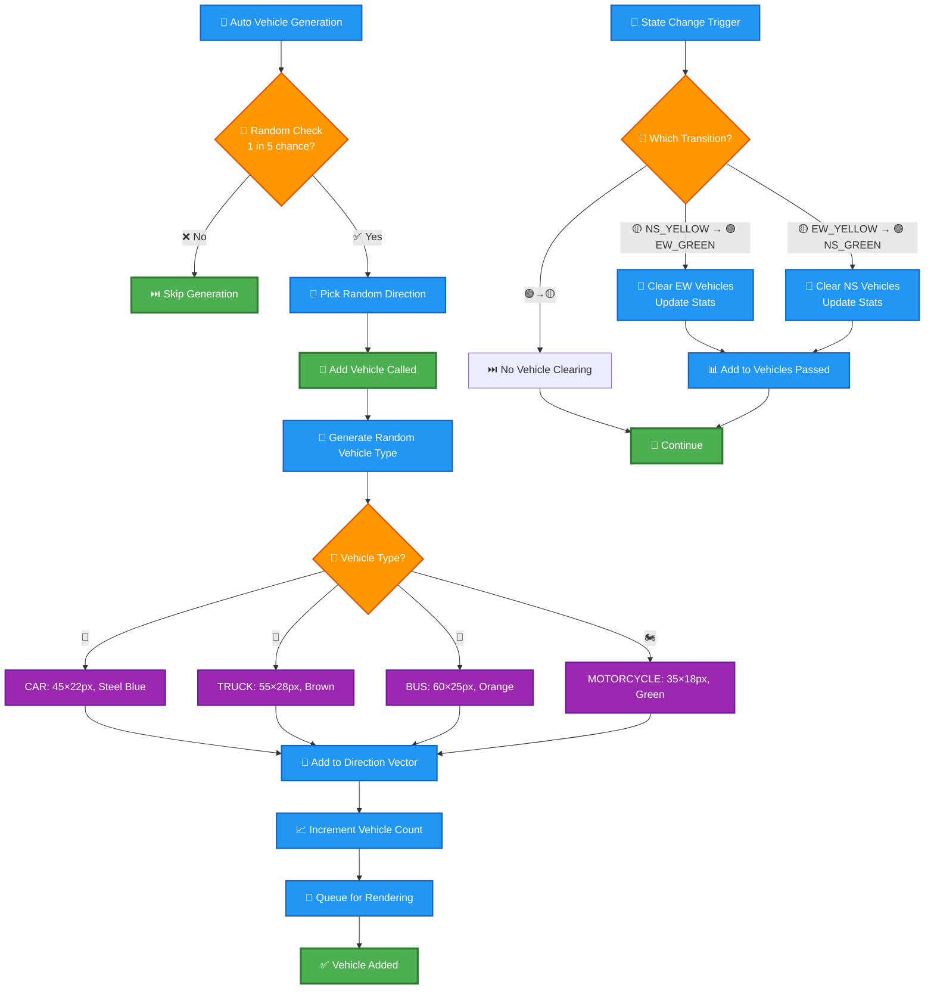
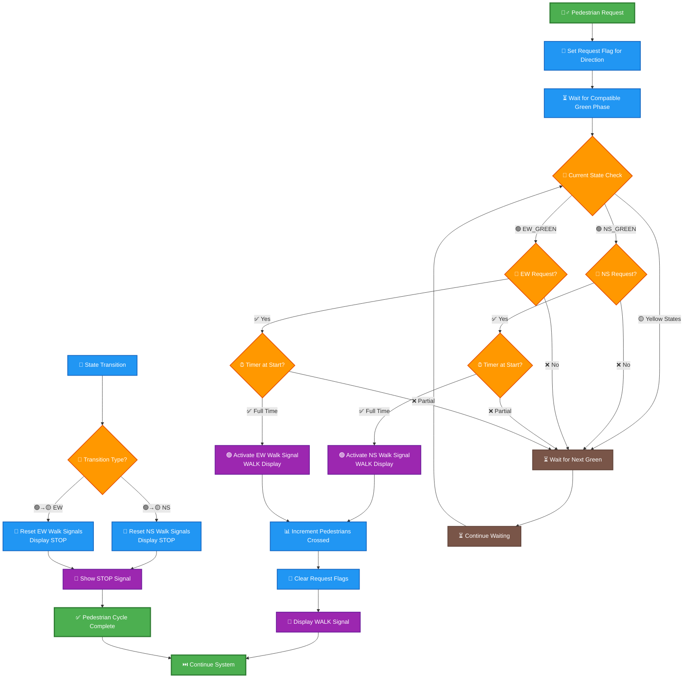
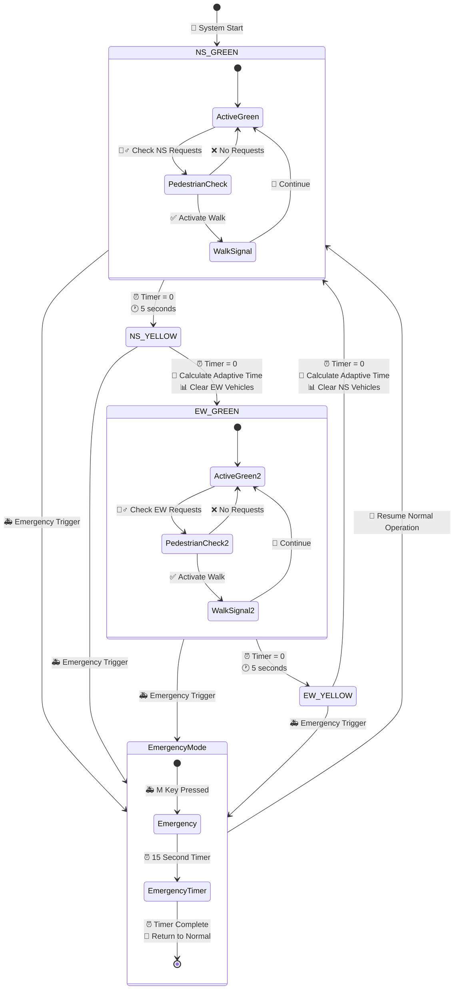
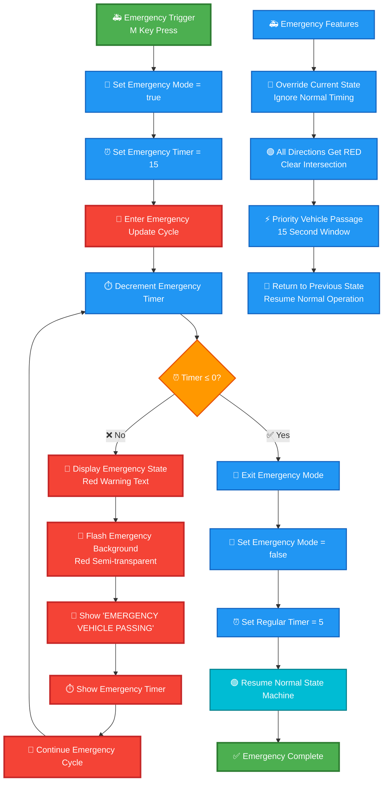
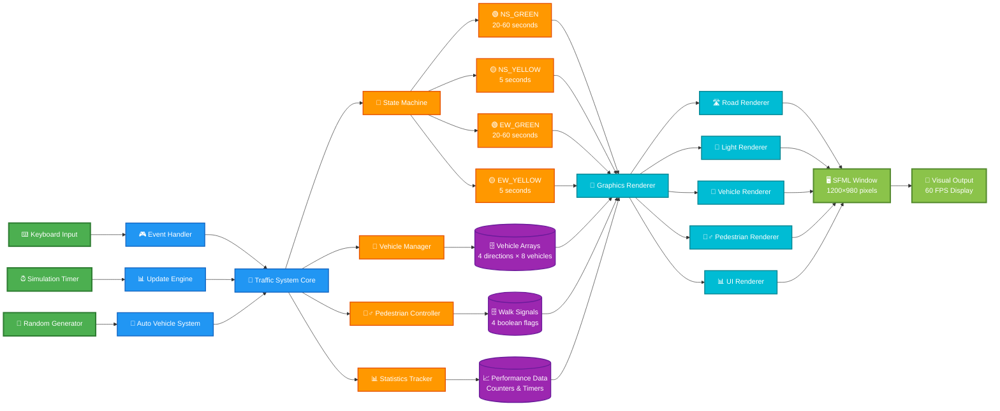
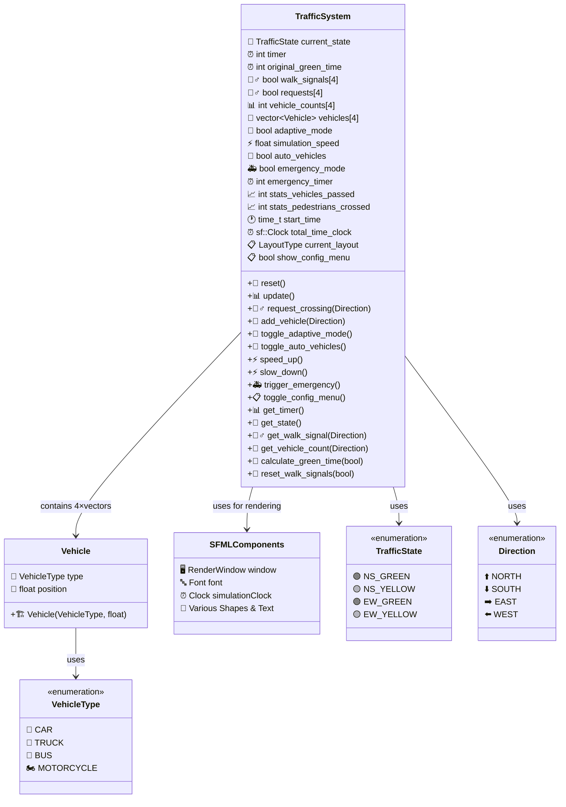

# 🚦 Smart Traffic Control System - Complete Flowchart

## 📊 System Overview Flowchart



## 🔧 Adaptive Algorithm Flowchart

```mermaid
flowchart TD
    A[🧠 Calculate Green Time Called] --> B{🎯 Adaptive Mode?}
    B -->|❌ No| C[⏰ Return Default 30s]
    B -->|✅ Yes| D{🚦 NS or EW Direction?}
    
    D -->|🔵 NS Direction| E[📊 Count NS Traffic<br/>North + South Vehicles]
    D -->|🔴 EW Direction| F[📊 Count EW Traffic<br/>East + West Vehicles]
    
    E --> G[📊 Count Cross Traffic<br/>East + West Vehicles]
    F --> H[📊 Count Cross Traffic<br/>North + South Vehicles]
    
    G --> I[🧮 Calculate Traffic Difference<br/>max(0, main_traffic - cross_traffic)]
    H --> I
    
    I --> J[⏱️ Calculate Extra Time<br/>min(40, traffic_diff × 2)]
    J --> K[✅ Return Final Time<br/>20 + extra_time seconds]
    
    C --> L[🏁 End]
    K --> L

    %% Styling
    classDef startEnd fill:#4CAF50,stroke:#2E7D32,stroke-width:3px,color:#fff
    classDef process fill:#2196F3,stroke:#1565C0,stroke-width:2px,color:#fff
    classDef decision fill:#FF9800,stroke:#E65100,stroke-width:2px,color:#fff
    classDef calculation fill:#9C27B0,stroke:#6A1B9A,stroke-width:2px,color:#fff
    
    class A,L startEnd
    class E,F,G,H,J,K process
    class B,D decision
    class C,I calculation
```

## 🚗 Vehicle Management Flowchart



## 🚶‍♂️ Pedestrian System Flowchart



## 🚦 Traffic State Machine Flowchart



## 🎨 Rendering Pipeline Flowchart

```mermaid
flowchart TD
    A[🎨 Start Rendering] --> B[🧹 Clear Window Background<br/>Color: RGB(30,30,50)]
    B --> C[📏 Calculate Scale Factors<br/>scaleX = scaleY = 1.0]
    
    C --> D[🏷️ Draw Title Text<br/>'SMART TRAFFIC CONTROL SYSTEM']
    D --> E[📋 Draw Main Panel<br/>1100×700px at (50,100)]
    
    E --> F[🛣️ Draw Intersection Roads]
    F --> G[📍 Calculate Center Point<br/>centerX=600, centerY=400]
    G --> H[🛤️ Draw Horizontal Road<br/>800×160px]
    H --> I[🛤️ Draw Vertical Road<br/>160×600px]
    I --> J[➖ Draw Lane Markings<br/>Dashed Lines]
    
    J --> K[🚦 Draw Traffic Light Boxes]
    K --> L[🔴 Draw North Traffic Light<br/>Red/Yellow/Green Circles]
    L --> M[🔴 Draw South Traffic Light<br/>Red/Yellow/Green Circles]
    M --> N[🔴 Draw East Traffic Light<br/>Red/Yellow/Green Circles]
    N --> O[🔴 Draw West Traffic Light<br/>Red/Yellow/Green Circles]
    
    O --> P[🚗 Vehicle Rendering Loop]
    P --> Q[🔵 Draw North Vehicles<br/>X=530, Y=120+i*30]
    Q --> R[🔵 Draw South Vehicles<br/>X=625, Y=520+i*30]
    R --> S[🔵 Draw East Vehicles<br/>X=978-i*25, Y=425]
    S --> T[🔵 Draw West Vehicles<br/>X=222+i*25, Y=330]
    
    T --> U{🚗 Vehicle Type Rendering}
    U -->|🚗 CAR| V[🔷 Blue Rectangle 45×22<br/>Label: 'CAR']
    U -->|🚛 TRUCK| W[🟤 Brown Rectangle 55×28<br/>Label: 'TRUCK']
    U -->|🚌 BUS| X[🟠 Orange Rectangle 60×25<br/>Label: 'BUS']
    U -->|🏍️ MOTORCYCLE| Y[🟢 Green Rectangle 35×18<br/>Label: 'BIKE']
    
    V --> Z[🚶‍♂️ Draw Pedestrian Signals]
    W --> Z
    X --> Z
    Y --> Z
    
    Z --> AA[🟢 North Signal: (700,170) WALK/STOP]
    AA --> BB[🟢 South Signal: (700,590) WALK/STOP]
    BB --> CC[🟢 East Signal: (820,500) WALK/STOP]
    CC --> DD[🟢 West Signal: (340,500) WALK/STOP]
    
    DD --> EE{🚶‍♂️ Request Indicators}
    EE -->|✅ Active| FF[💙 Draw Request Circle<br/>Blue Highlight + 'REQ']
    EE -->|❌ None| GG[📊 Draw Status Panel]
    FF --> GG
    
    GG --> HH[📋 Draw Status Panel<br/>1100×220px at (50,720)]
    HH --> II[🚦 Draw Current State Text<br/>Color-coded by State]
    II --> JJ[⏰ Draw Timer Display<br/>Countdown in Blue]
    JJ --> KK[📊 Draw Statistics<br/>Vehicles/Pedestrians/Time]
    KK --> LL[⚙️ Draw Settings Display<br/>Adaptive/Auto/Speed Status]
    
    LL --> MM[🎮 Draw Control Instructions]
    MM --> NN[📝 Controls Title: 'CONTROLS:']
    NN --> OO[🚶‍♂️ Pedestrian Controls Line]
    OO --> PP[🚗 Vehicle Controls Line]
    PP --> QQ[⚙️ System Controls Line]
    
    QQ --> RR{📋 Config Menu?}
    RR -->|✅ Open| SS[📋 Draw Configuration Panel<br/>400×300px Semi-transparent]
    RR -->|❌ Closed| TT[👣 Draw Footer Text]
    
    SS --> UU[🏷️ Config Title & Layout Info]
    UU --> VV[📝 Feature List Display]
    VV --> WW[🔄 Close Instructions]
    WW --> TT
    
    TT --> XX{🚑 Emergency Mode?}
    XX -->|✅ Active| YY[🚨 Draw Emergency Overlay<br/>Red Background + Text]
    XX -->|❌ Normal| ZZ[🖥️ Display Final Frame]
    YY --> ZZ
    
    ZZ --> AAA[⏱️ Frame Rate Control<br/>16ms Sleep]
    AAA --> BBB[🏁 Rendering Complete]

    %% Styling
    classDef startEnd fill:#4CAF50,stroke:#2E7D32,stroke-width:3px,color:#fff
    classDef process fill:#2196F3,stroke:#1565C0,stroke-width:2px,color:#fff
    classDef decision fill:#FF9800,stroke:#E65100,stroke-width:2px,color:#fff
    classDef render fill:#00BCD4,stroke:#00838F,stroke-width:2px,color:#fff
    classDef vehicle fill:#9C27B0,stroke:#6A1B9A,stroke-width:2px,color:#fff
    classDef ui fill:#8BC34A,stroke:#558B2F,stroke-width:2px,color:#fff
    
    class A,BBB startEnd
    class B,C,G,HH,II,JJ,KK,LL,MM,NN,OO,PP,QQ,TT,UU,VV,WW,AAA process
    class EE,RR,XX decision
    class D,E,F,G,H,I,J,K,L,M,N,O,P,Q,R,S,T,Z,AA,BB,CC,DD,FF,SS,YY,ZZ render
    class V,W,X,Y vehicle
```

## ⌨️ Keyboard Input Handler Flowchart

```mermaid
flowchart TD
    A[⌨️ Key Press Event] --> B{🔑 Key Identification}
    
    %% Pedestrian Controls
    B -->|🔤 N| C[🚶‍♂️ Request North Crossing<br/>requests[NORTH] = true]
    B -->|🔤 S| D[🚶‍♂️ Request South Crossing<br/>requests[SOUTH] = true]
    B -->|🔤 E| E[🚶‍♂️ Request East Crossing<br/>requests[EAST] = true]
    B -->|🔤 W| F[🚶‍♂️ Request West Crossing<br/>requests[WEST] = true]
    
    %% Vehicle Addition
    B -->|🔢 1| G[🚗 Add Vehicle to North<br/>Random Type Generation]
    B -->|🔢 2| H[🚗 Add Vehicle to South<br/>Random Type Generation]
    B -->|🔢 3| I[🚗 Add Vehicle to East<br/>Random Type Generation]
    B -->|🔢 4| J[🚗 Add Vehicle to West<br/>Random Type Generation]
    
    %% System Controls
    B -->|🔤 T| K[🧠 Toggle Adaptive Mode<br/>adaptive_mode = !adaptive_mode]
    B -->|🔤 A| L[🤖 Toggle Auto Vehicles<br/>auto_vehicles = !auto_vehicles]
    B -->|➕ +| M[⚡ Speed Up<br/>min(5.0, speed + 0.5)]
    B -->|➖ -| N[🐌 Slow Down<br/>max(0.5, speed - 0.5)]
    B -->|🔤 M| O[🚑 Trigger Emergency<br/>15-second override]
    B -->|🔤 C| P[📋 Toggle Config Menu<br/>show_config_menu = !show_config_menu]
    B -->|🔤 R| Q[🔄 Reset Entire System<br/>Clear all data]
    B -->|🔤 Q| R[🚪 Quit Application<br/>Close window]
    
    %% Processing Results
    C --> S[✅ Pedestrian Request Queued]
    D --> S
    E --> S
    F --> S
    
    G --> T[✅ Vehicle Added to Queue]
    H --> T
    I --> T
    J --> T
    
    K --> U[✅ Adaptive Mode Toggled]
    L --> U
    M --> U
    N --> U
    O --> U
    P --> U
    
    Q --> V[🔄 System Reset Complete<br/>Return to NS_GREEN]
    R --> W[🏁 Application Termination]
    
    S --> X[🔄 Continue Main Loop]
    T --> X
    U --> X
    V --> X

    %% Styling
    classDef startEnd fill:#4CAF50,stroke:#2E7D32,stroke-width:3px,color:#fff
    classDef process fill:#2196F3,stroke:#1565C0,stroke-width:2px,color:#fff
    classDef decision fill:#FF9800,stroke:#E65100,stroke-width:2px,color:#fff
    classDef pedestrian fill:#9C27B0,stroke:#6A1B9A,stroke-width:2px,color:#fff
    classDef vehicle fill:#00BCD4,stroke:#00838F,stroke-width:2px,color:#fff
    classDef system fill:#8BC34A,stroke:#558B2F,stroke-width:2px,color:#fff
    classDef result fill:#FF5722,stroke:#D84315,stroke-width:2px,color:#fff
    
    class A,W,X startEnd
    class B decision
    class C,D,E,F pedestrian
    class G,H,I,J,T vehicle
    class K,L,M,N,O,P,Q,R system
    class S,U,V result
```

## 🚑 Emergency Mode System Flowchart



## 📊 Statistics & Monitoring Flowchart

```mermaid
flowchart TD
    A[📊 Statistics System] --> B[⏰ High-Precision Timer<br/>sf::Clock total_time_clock]
    B --> C[📈 Vehicle Statistics Tracking]
    C --> D[🚶‍♂️ Pedestrian Statistics Tracking]
    
    D --> E[🚦 State Change Monitoring]
    E --> F{🔄 State Transition?}
    F -->|🟡→🟢 NS_YELLOW to EW_GREEN| G[📊 Count EW Vehicles Passed<br/>stats_vehicles_passed += EW count]
    F -->|🟡→🟢 EW_YELLOW to NS_GREEN| H[📊 Count NS Vehicles Passed<br/>stats_vehicles_passed += NS count]
    F -->|🟢→🟡 Green to Yellow| I[⏭️ No Vehicle Counting]
    
    G --> J[🧹 Clear EW Vehicle Arrays<br/>vehicles[EAST/WEST].clear()]
    H --> K[🧹 Clear NS Vehicle Arrays<br/>vehicles[NORTH/SOUTH].clear()]
    I --> L[🚶‍♂️ Pedestrian Request Processing]
    J --> L
    K --> L
    
    L --> M{🚶‍♂️ Walk Signal Activated?}
    M -->|✅ Yes| N[📈 Increment Pedestrians Crossed<br/>stats_pedestrians_crossed++]
    M -->|❌ No| O[📊 Real-time Display Update]
    N --> O
    
    O --> P[📺 Format Display Strings]
    P --> Q[🕐 Format Elapsed Time<br/>MM:SS format]
    Q --> R[📊 Vehicle Count: 'Vehicles: X']
    R --> S[🚶‍♂️ Pedestrian Count: 'Pedestrians: Y']
    S --> T[⏱️ Runtime: 'Time: MM:SS']
    T --> U[🎨 Render Statistics Panel]
    
    U --> V[📋 Settings Display]
    V --> W[🧠 Adaptive Status: 'Adaptive: ON/OFF']
    W --> X[🤖 Auto Vehicles: 'Auto Vehicles: ON/OFF']
    X --> Y[⚡ Speed Factor: 'Speed: X.Xx']
    Y --> Z[✅ Statistics Complete]

    %% Styling
    classDef startEnd fill:#4CAF50,stroke:#2E7D32,stroke-width:3px,color:#fff
    classDef process fill:#2196F3,stroke:#1565C0,stroke-width:2px,color:#fff
    classDef decision fill:#FF9800,stroke:#E65100,stroke-width:2px,color:#fff
    classDef stats fill:#9C27B0,stroke:#6A1B9A,stroke-width:2px,color:#fff
    classDef display fill:#00BCD4,stroke:#00838F,stroke-width:2px,color:#fff
    classDef data fill:#8BC34A,stroke:#558B2F,stroke-width:2px,color:#fff
    
    class A,Z startEnd
    class B,C,D,E,G,H,J,K,N,P,Q,R,S,T,V,W,X,Y process
    class F,M decision
    class I,L,O,U stats
    class display
```

## 🔄 System Reset Flowchart

```mermaid
flowchart TD
    A[🔄 Reset System Called<br/>R Key Press] --> B[🚦 Set State = NS_GREEN]
    B --> C[⏰ Set Timer = 30 seconds]
    C --> D[⏰ Set Original Green Time = 30]
    D --> E[🧠 Enable Adaptive Mode = true]
    E --> F[⚡ Set Simulation Speed = 1.0x]
    F --> G[🤖 Enable Auto Vehicles = true]
    G --> H[🚑 Disable Emergency Mode = false]
    H --> I[⏰ Reset Emergency Timer = 0]
    
    I --> J[📊 Reset Statistics Counters]
    J --> K[🚗 Reset Vehicles Passed = 0]
    K --> L[🚶‍♂️ Reset Pedestrians Crossed = 0]
    L --> M[🕐 Reset Start Time = current time]
    M --> N[⏰ Restart High-Precision Clock]
    
    N --> O[🔄 Clear All Direction Arrays]
    O --> P[🚫 Reset Walk Signals[4] = false]
    P --> Q[🚫 Reset Requests[4] = false]
    Q --> R[📊 Reset Vehicle Counts[4] = 0]
    R --> S[🧹 Clear Vehicle Vectors[4]]
    
    S --> T[📋 Reset Config Menu = false]
    T --> U[🎯 Reset Layout = STANDARD_4WAY]
    U --> V[✅ System Reset Complete]
    V --> W[🔄 Return to Main Loop]

    %% Styling
    classDef startEnd fill:#4CAF50,stroke:#2E7D32,stroke-width:3px,color:#fff
    classDef process fill:#2196F3,stroke:#1565C0,stroke-width:2px,color:#fff
    classDef reset fill:#FF5722,stroke:#D84315,stroke-width:2px,color:#fff
    classDef data fill:#9C27B0,stroke:#6A1B9A,stroke-width:2px,color:#fff
    classDef system fill:#00BCD4,stroke:#00838F,stroke-width:2px,color:#fff
    
    class A,V,W startEnd
    class B,C,D,E,F,G,H,I,J,K,L,M,N,O,P,Q,R,S,T,U reset
```

## 🎮 Complete System Data Flow



## 🏗️ Class Structure & Memory Layout


